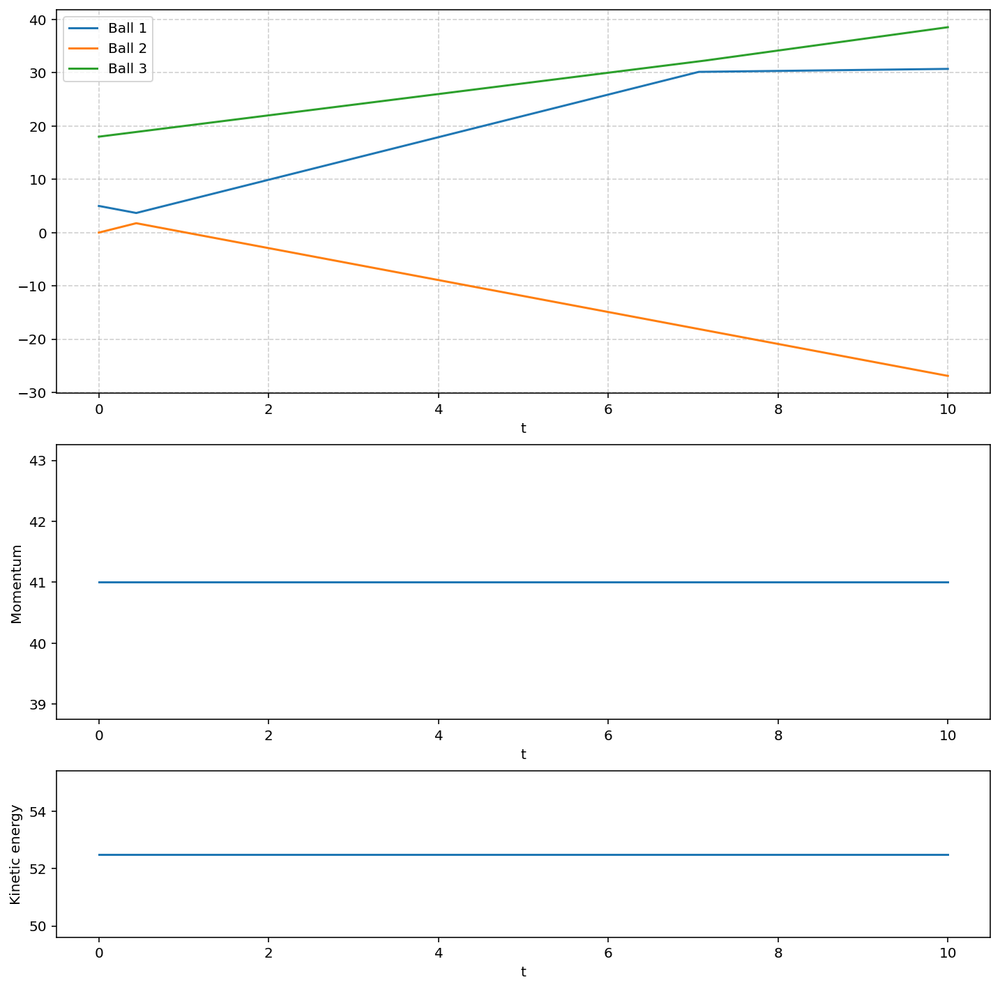

# COLLISIONS
Due to the conservation of the momentum, namely linear in the context of our discussion, we expect that a system contains many particles to obey this conservation numerically regardless of the number of particles as follows:

$$\vec{p}_{total} = \vec{p}_{initial} = \vec{p}_{final}$$
as
$$\vec{p}_{total} = \sum_{i=1}^{n} \vec{p_i} $$
for each body in the system. To be more precise, since we are dealing with one axis at a time, we do not need to use vector notation:
$$ p_{total}=p_1+p_2+...p_n = m_1v_1+m_2v_2+... $$
so that we do not need to worry about y-axis for now.
As we can see from the graph 2 from the image (centered one), the total momentum is indeed conserved. By using the *Ball* class, we calculate the velocity for each ball for specified moments in time by providing a good time differentiation as $dt=0.01 $

