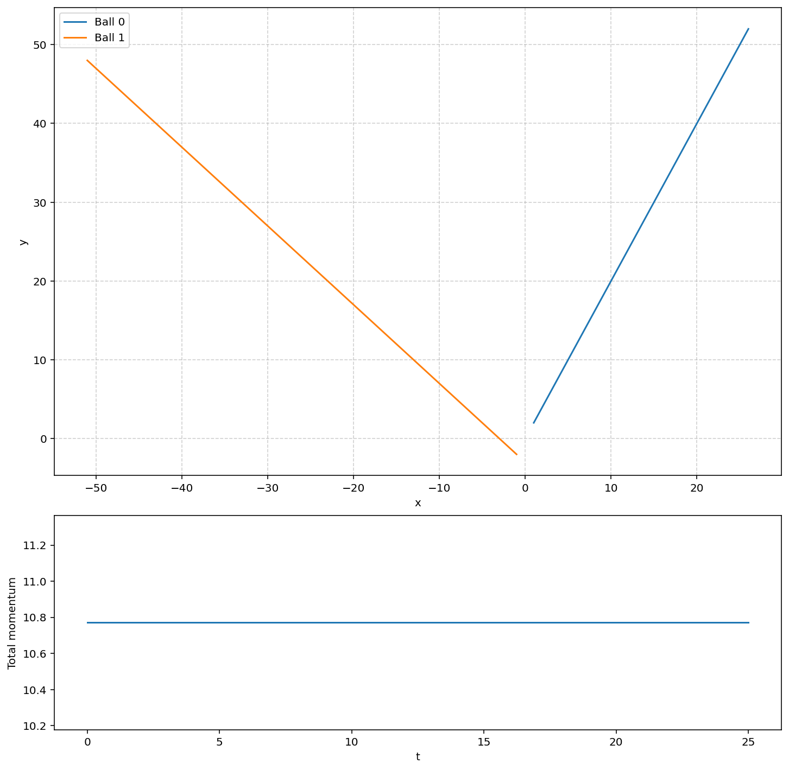

# 2D Elastic Collision Simulation

This project simulates the dynamics of multi-body elastic collisions in a 2D plane using object-oriented Python, `scipy.integrate.solve_ivp` for differential equation solving, and NumPy for vector operations.

## Physics Overview

The simulation is governed by the **Law of Conservation of Linear Momentum**. For a closed system of $n$ interacting particles where the net external force $\vec{F}_{\text{net}} = 0$, the total momentum $\vec{p}_{\text{total}}$ remains constant over time:

$$\vec{p}_{\text{total}}(t) = \sum_{i=1}^n \vec{p}_i(t) = \vec{p}_{\text{initial}} = \vec{p}_{\text{final}}$$

For this specific implementation, external forces are set to zero to observe clean, unperturbed elastic conservation transitions during instantaneous impulse exchanges.

## Code Architecture & Simulation Loop

Instead of managing separate scalar variables for the $x$ and $y$ components of each particle, the system leverages **NumPy vectorization** to handle state configurations efficiently.

### 1. Object-Oriented State Management
* **`__init__` Method:** Instantiates each mass with its unique physical properties: mass ($m$), position vector ($\vec{r}$), velocity vector ($\vec{v}$), and net forces.
* **`allBalls` Class List:** Appends every created instance to a master tracker to allow synchronous state updates.

### 2. Event Detection & Piecewise Integration
Because collisions introduce instantaneous discontinuities in velocity, a continuous ODE solver cannot step through an impact natively. The simulation solves this using a piecewise approach inside a `while` loop:

1. **`solve_ivp` Integration:** Dynamically integrates the equations of motion across a specified time interval.
2. **Collision Event Tracking:** The system utilizes a custom event factory function (`make_event`). This automatically generates state-dependent event functions for every unique pair combination in the system.
3. **State Correction:** When the center-to-center distance between any two particles matches their combined radii, `solve_ivp` halts integration, returns a status flag, and triggers the classmethod handling the impulse math. 
4. **Velocity Reset:** Velocities are resolved along their normal and tangential components to satisfy elastic collision equations, updating the master state matrix before resuming the integration loop.

## Results & Visualization

The simulation records the trajectory paths of the masses and continuously tracks the system's total momentum vectors to verify absolute conservation across discrete collision events.

