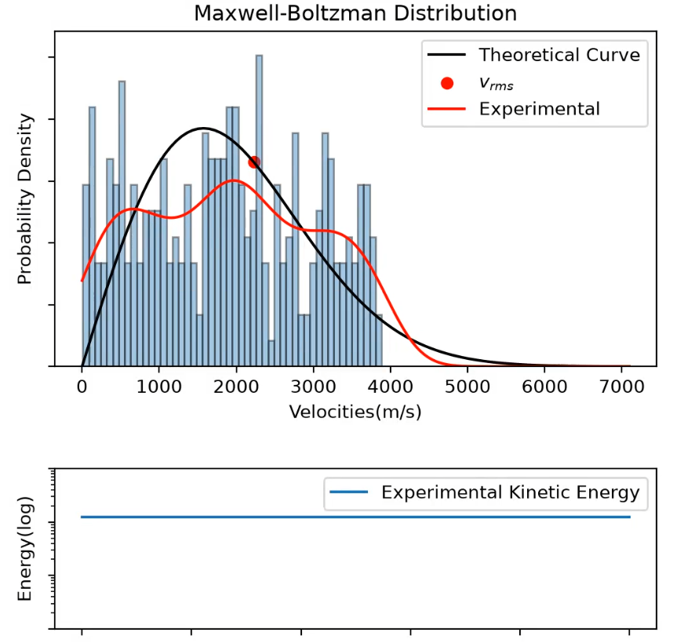
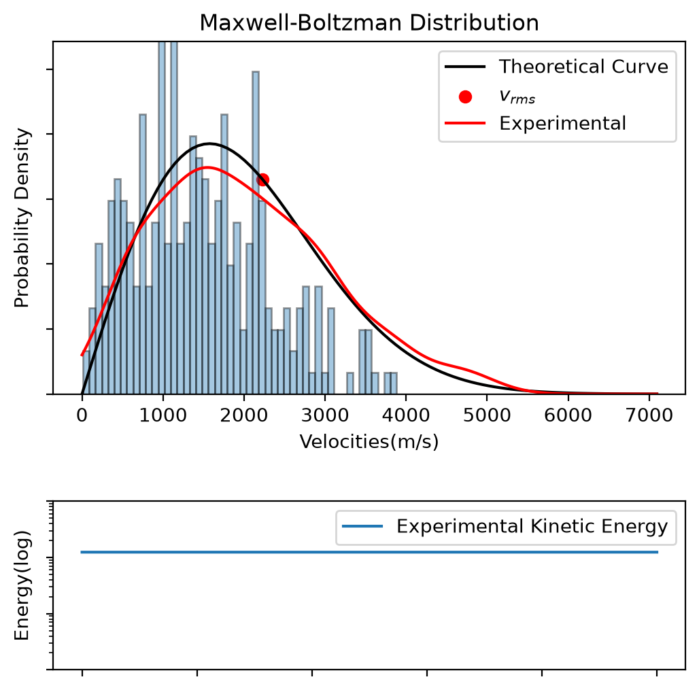

# Maxwell-Boltzmann Distribution
According to the Maxwell's and Boltzmann's analyses, 
we can examine an isolated system containing gas particles so 
that we can determine and analyze their speed for our favor. Provided that the following conditions are satisfied, which is likely to be case in real world, we will get a curve called **Maxwell-Boltzmann Distribution**:
* We consider a isolated system whose temperature is constant. For convention, we will consider the system as a box.
* At the beginning, we assume that initial positions of particles and their velocity vectors along with the velocity components and the direction, obviously.
* We neglect the intermolecular forces since they are too small to affect the final result

Since the particles will collide each other and the walls of the box, the system will reach a thermal equilibrium at some point and yields a specific curve with the equation $$\frac{M}{k_bT}ue^{\frac{-Mu^2}{2k_bT}}$$ with a total kinetic energy $$E_{total}=k_bTN$$ where $M$ is the mass of a particle in kg with a speed $u$ in a *N* particle system .
## Code Explaination
### Setting Up the Environment
We set our temperature as *T=300K* and keep in mind that our system is in 2D. To most important part to begin with is to distribute the velocity randomly since the total kinetic energy of the particles must corresponds to the theoretical kinetic energy.
- We name our boundaries as L for the enclosed arbitrary space box.
- To determine the random position $\vec{r}=(x,y)$ we use the code block `np.random.rand()*L` so that our initial positions can be set in $[0,L]$ for both *x* and *y*. We set their velocity as zero to create all particles in the system first but we will update them.
- To determine the velocities, we need to determine an upper limit. Because the exponential decay is sharp, for convention and sake of the plotting and animation, we set our maximum velocity to be $3.5v_p$ where $v_p$ is the most probable speed, that is the peak of the curve. If we calculate the total $$\int_{0}^{3.5v_p}f(u)du \approx 0.9978 $$ Hence our choice of maximum velocity,`vmax=3.5*vp` is appropriate for numerical solutions. We give a random value between *0* and *vmax* with random direction, hence components, provided with the `np.array([i.lambda_x,i.lambda_y])` block.
- But the problem is we did not distribute the speed based on total kinetic energy. At the moment, total kinetic energy of the particles may excess $E_{total}$.To prevent it, we use a factor $e=\sqrt{\frac{E_{Particles}}{E_{total}}}$ to update the velocities to fit to the system. We get initial velocities as $v_i$ and maximum velocity $vmax$ to use in our code.
- After setting up the initial environment, we need to simulate a collision process and the function `collision(particles,dt,tf,M)` operates this process. We create new arrays for each components of positions and velocities to vectorize and optimize our coding and thus, we reshape them with the *numpy.reshape* function.
- for each step, we record the total kinetic energy and update our array. The reason we use pre-filled zero arrays through our code is to optimize. And to cut down the total time for optimization we record every *shot=100* steps.
- We start with updating the positions to make particles move for a small segment of time *dt=0.0005*. Then we start to check for the collisions.

Initially, our system looks as follows: 

### Collision Mechanic
---
#### Wall Collisions
- We create conditions for each wall and update the velocities to be the opposite for each component. Numpy masking and process by components enable us to work faster in process so that we do not have to work with vectors for now, which would require new arrays and base vectors. 
- Each condition check whether the ball is passing the walls or not since we cannot precisely equal the position of the ball and wall in numeric solutions.
- Generally, in the sake of collisions to continue, we usually push the particles a little so that the function we wrote would not detect after-collision as a new collision since it would still satisfy the condition. But since we update the positions at the beginning of each step and not until the loop finished, we do not worry about it here.

#### Particle Collisions
- To determine the collisions of particles each other, we first create an *dr* array to determine the distance between each particle using the method

$$
\begin{bmatrix} 
x_1 \\ 
x_2 \\ 
\vdots \\ 
x_N 
\end{bmatrix}
\begin{bmatrix} 
x_1 & x_2 & \cdots & x_N 
\end{bmatrix} 
= 
\begin{bmatrix} 
x_{11} & x_{12} & \cdots & x_{1N} \\ 
\vdots & \vdots & \ddots & \vdots \\ 
x_{N1} & x_{N2} & \cdots & x_{NN} 
\end{bmatrix}
$$

- We do the same calculations for the velocities to determine 
$\vec{v_{rel}} \cdot \vec{r_{rel}}$. *pCol* variable holds the conditions we need to check, which are 
    * `(dr <= 2*R)` whether the particle collide or not 
    * `(vDOTr<0)` whether they move to each other or move away, which means we want our function to detect the event before-collisions since afterwards would still trigger the detection otherwise.
    * ` (row<col)` we do not want to extract the informations twice from the result array from above and do not want to detect the self-collisions due to the calculation.

To work easily, we need to derive a formula for collision. During the collision, a momentum transferred as $\vec{P}=P_0\hat{k}$ where $\hat{k}$ is the base vector align with the center of the particles, meaning direction with the collisions and it is defined as 

$$
\hat{k}=\frac{\vec{r_i}-\vec{r_j}}{\left |{\vec{r_i}-\vec{r_j}}\right |}=\vec{r_{ij}}
$$ 
for each two particle. Thus we can update their velocities after the collision as 
$$\vec{v_i}'=\vec{v_i}+\frac{\vec{P}}{M}$$ $$\vec{v_j}'=\vec{v_j}-\frac{\vec{P}}{M}$$
Based on the assumptions Maxwell consider above, collisions are elastic and the kinetic energy for each pair is conserved during the collision. If we solve the energy equations, we get the result 
$$
\vec{P}=-2\frac{m_i m_j}{m_i+m_j}[(\vec{v_i}-\vec{v_j}) \cdot \vec{r_{ij}}]\vec{r_{ij}}
$$
From line 89 to 115 in *collisionMechanic.py* we operate this process. From the condition boolen array *pCol*, we detect the pairs and calculate the product. We use `numpy.hstack` to reshape the array so that each row corresponds one particle. At the end, we print the total collision among the particles to make sure that collision occured so that one can debug if it is not so. Finally, we return the final velocities *v* and kinetic energy array *ke*. 

In **distribution.py**, to get the theoretical probability curve, we define a *F(u)* function. The rest of the code is to animate the process with the `matplotlib.FuncAnimation` function.

After the collisions completed, our system represented as following:
 

As one can realize, it takes time to reach the thermal equilibrium. For more detailed representing, look for *simulation.mp4* video in the folder.
